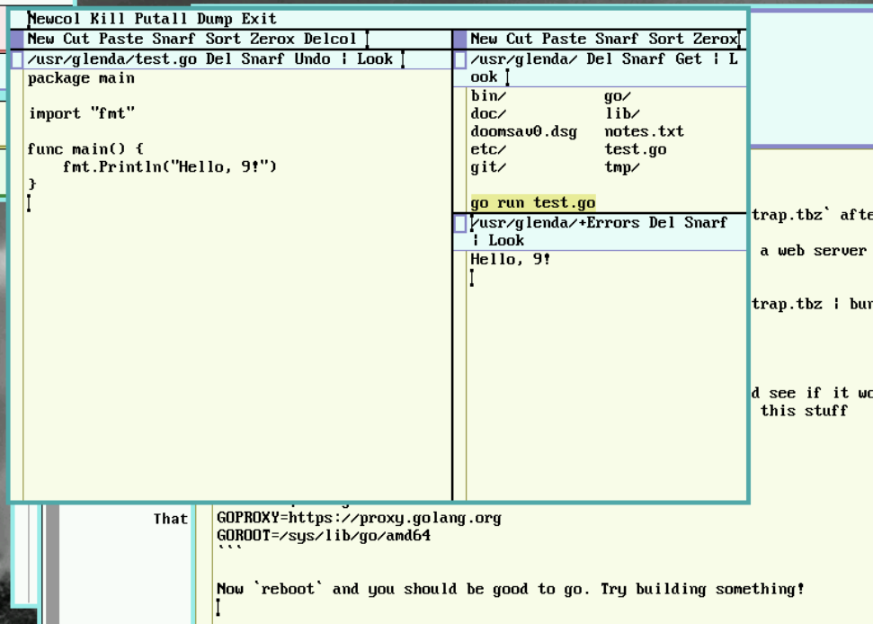

# notes on using Go in Plan 9

## Installation

**ACHTUNG! (2025 December 27)** Instructions on this stuff is kinda contradictory.
This is how I, personally, got Go working in 9front. Much like others' notes on this,
the instructions could be outdated or just plain *wrong*. Use your brain! **Your mileage may vary**.

ACHTUNG! (2026 January 19) ARM64 users: there is not yet an official port of Go to `plan9/arm64`.
There is, however, a working (albeit slightly outdated)
[community branch](https://github.com/psilva261/go-arm64.plan9) available.

### Prerequisite

Before we start, I recommend running this totally unrelated command if you haven't already.
You'll thank me later.

```
hget https://curl.haxx.se/ca/cacert.pem > /sys/lib/tls/ca.pem
```

I am mentioning this first so you may easily ignore it if you've already done this.
Since Go is designed specifically with modern internet connections in mind, you'll obviously
want a working CA certificate, which Plan 9(front) does not ship with.

### Bootstrap from another OS

Go is written in Go, and it cannot be built with super old versions of Go. Additionally,
the last version of Go to be written in C was **1.4.3**. This means, as I understand it,
if you don't cross-compile from another machine, you'll be compiling like 10 previous
versions of Go in sequence. Don't do that.

You can cross-compile Go from a Linux machine with Go already installed:

```
wget https://go.dev/dl/go1.25.5.src.gz
tar xf go1.25.5.src.tar.gz
cd go/src
GOOS=plan9 GOARCH=amd64 ./bootstrap.bash
```

My PC's fans had a lot of fun with this.

You'll get a file somewhere like `../../go-plan9-$objtype-bootstrap.tbz` after.

Get this file on your plan 9 machine. If you can stick it on a web server you can do:

```
hget http(s)://www.example.com/wherever/go-plan9-$objtype-bootstrap.tbz | bunzip2 -c | tar x
mkdir /sys/lib/go
mv go-plan9-$objtype-bootstrap /sys/lib/go/$objtype
```

If you are using your Plan 9 machine through `drawterm`, you can copy the file without such hassle.

```
mkdir /sys/lib/go && cd /sys/lib/go
cp /mnt/term/path/to/local/go-plan9-$objtype-bootstrap.tbz .
bunzip -c go-plan9-$objtype-bootstrap.tbz | tar x
mv go-plan9-$objtype-bootstrap $objtype
```

Try invoking `/sys/lib/go/$objtype/bin/go` with no arguments and see if it works.
If it does, go ahead and run `mkdir -p $home/go/bin` and add this stuff
somewhere in your `$home/lib/profile`:

```
bind -a /sys/lib/go/$objtype/bin /bin
bind -a $home/go/bin /bin
GOPROXY=https://proxy.golang.org
GOROOT=/sys/lib/go/$objtype
```

Now `reboot` and you should be good to go. Try building something!


